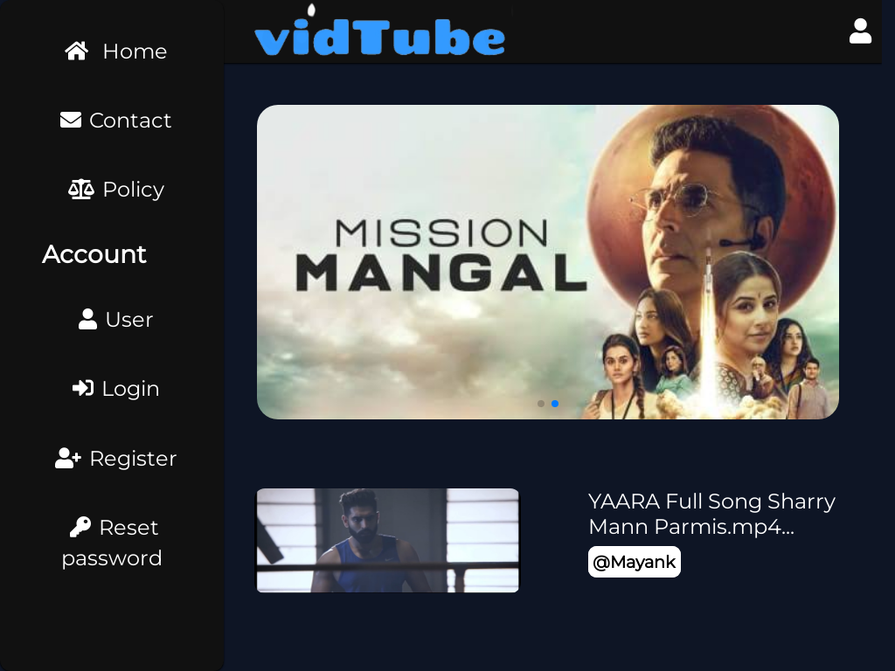

# vidTube

A video streaming website made using nodeJs ,mongodb and ejs as view engine



# Features

• Create account and upload videos

• Like, dislike, share , download, report videos

• Add comments

• Admin panel for managing users and reported videos

# Accessing admin panel

There is same login system for both users and admins to become admin set role to your account as admin in database i.e ``` role:"admin" ```
